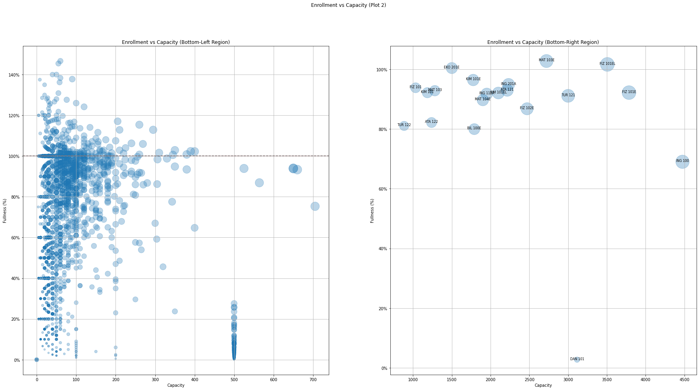

# **YZV 475E (14985)** - _Term Project_
 
**Name:** Ata Türkoğlu

**Student ID:** 150210337

## How to use

1. Install [_Python_](https://www.python.org/downloads/).
2. Make sure you are connected to internet as the data is fetched from the web (after the initial usage, a cache is created for offline usage as well).
3. Install the required packages with _pip_, using the following command:
   ```console
    pip install -r requirements.txt
   ```
4. Run the `src/main.ipynb` file.

## How it works

The `src/itu_helper.py` function is a wrapper which fetches data from [ITU Helper](https://github.com/itu-helper/data-updater) and uses the `src/data_structres/course.py` and `src/data_structres/lesson.py` to store the data it fetches. Then, from the `src/main.ipynb` _Jupyter Notebook_ file, the `ItuHelper` class is used for accesing the data and visualizing it using the [_matplotlib_](https://matplotlib.org/) library.

## Comments on the Findings

### **Plot 1**


This plot shows the distrbution of capacity and the fullness for each course. We can see the majority of the courses fall in the bottom-left region where capacity is below $800$ and fullness is below $150\%$.

#### Bottom-Left Region

It is hard to talk about the bottom-left region as it is really cluttered, we'll have to take a deeper look to find something from it.

#### Bottom-Right Region

In the bottom-right region we can see the courses with highest capacities, and, most of them are almost full, showing that there is enough lectures available for them, with few exceptions.

- We can decrease the capacity of _ING 100_ and _DAN101_.
- We need to increase the capacity for _MAT 103E_, _FIZ 101EL_ and _EKO 201E_

#### Top-Left Region

This region has courses with enrollments extremely about the capacity. We can see that these are mostly major-specific courses, which explains why the capacity is too low. We may need to increase their capacity by just opening one more lecture for each of them.

### **Plot 2**



These two plots are follow-ups on _Plot 1_, the left one being the bottom-left region, and the right one being the bottom-right region.

#### Left Plot
We can see a really interesting spherical pattern occur in the bottom-left part of this plot. It is hard to explain what it is but looks interesting.

We can see there are a lot of courses with fullness between $100\%$ and $150\%$, which needs an increase in capacity. Only problem with this data is, when a course is full in capacity, university stuff can assign students to the already-full courses, which increase the capacity above $100\%$, however, in cases where the university stuff does not do that, they remain at $100\%$ capacity.

To determine which courses actually need an increase in capacity, we will have to skip the courses at $100\%$ capacity and start with a higher threashold of $120\%$ capacity.

#### Right Plot
Here, we can see the bottom-right part of _Plot 1_ more clearly, the analysis for this part will be the same as _Plot 1_'s analysis.
- We can decrease the capacity of _ING 100_ and _DAN101_.
- We need to increase the capacity for _MAT 103E_, _FIZ 101EL_ and _EKO 201E_

### **Plot 3**


This plot is the zoomed in version of the left plot in _Plot 2_. The courses above the red line needs a capacity increase, below are the top-20 of them:

1. MTO 451E : ($224.00\%$ full)		(Oceanography)
1. MTO 350E : ($190.00\%$ full)		(Air Pollution Fundamentals)
1. KMM 332  : ($168.57\%$ full)		(Ayırma İşlemleri)
1. LAT 161  : ($160.00\%$ full)		(English Composition)
1. MIM 4085E: ($160.00\%$ full)		(Byzantine Heritage inİstanbul)
1. END 337E : ($152.50\%$ full)		(Intr. to Operations Research)
1. MTO 357E : ($150.00\%$ full)		(Physics of Upper Atmosphere)
1. ELK 214E : ($146.67\%$ full)		(Fund.of Electr. Energy Conver.)
1. UCK 459E : ($145.45\%$ full)		(Helicopter Theory)
1. ELK 415E : ($140.00\%$ full)		(Digital Protection&amp;Signalling)
1. MIM 411  : ($140.00\%$ full)		(Mimari Proje VII)
1. UZB 318E : ($138.33\%$ full)		(Finite Element Method)
1. ELK 411E : ($137.78\%$ full)		(High Voltage Lab.)
1. UCK 372E : ($137.50\%$ full)		(Experimental Engineering)
1. SNT 108  : ($136.21\%$ full)		(Seramik)
1. ELK 493E : ($135.00\%$ full)		(Lighting Tech.&amp;Photometry Lab.)
1. END 311E : ($130.91\%$ full)		(Statistics)
1. MTO 464E : ($130.00\%$ full)		(Climate Change)
1. GID 413  : ($128.57\%$ full)		(Biyoteknoloji)
1. SNT 109  : ($128.57\%$ full)		(Kazı Resim (Gravür))


### **Plot 4**


In this plot, we have a pie chart for each building of the University, showing the number of enrolled students for each day of the week. Here, the data is a bit too complicated, yet we can still get some insights.

> :warning: If a student has multiple courses on the same day, there is no way to identify it so the data might include duplicated enrollment data for some students.

#### _Merkezi Derslik B Binası (Gölet Derslik Binası)_

We can see that _MED B_ is really busy on Tuesdays with almost $50\%$ of it's weekly capacity present. And then on Fridays, there is only $1.5\%$ of it's weekly capacity present. The courses could be adjusted to even out the distribution.

#### _İşletme Binası_ & _Motorlar Binası_

Again, there is a huge unevenness in these building's weekly distribution, but, as there aren't that many students, no adjustments are needed.

### **Plot 5 & 6**


We can see that the university is less busy on Fridays and Wednesdays, with Saturday being the least busy, excluding Sunday as there are no courses on Sundays, with only 42 students enrolled. 

**the top-5 busiests buildings:**

- Merkezi Derslik A Binası: $19,153$ students enrolled weekly
- İnşaat Binası: $18,859$ students enrolled weekly
- Fen-Edebiyat Binası: $15,167$ students enrolled weekly
- Elektrik-Elektronik Binası: $14,501$ students enrolled weekly
- Mimarlık Binası: $14,107$ students enrolled weekly

**the top-5 least busy buildings are:**

- Ruhi Sarıalp Seminer Salonu-Beden Eğitimi Bölümü: $27$ students enrolled weekly
- Sağlıklı Yaşam Merkezi: $43$ students enrolled weekly
- Tenis Kortları: $90$ students enrolled weekly
- İTÜ Olimpik Stadyumu: $90$ students enrolled weekly
- Spor Salonu-Beden Eğitimi Bölümü: $91$ students enrolled weekly

We can also calculate the average enrolled student count per day as $22,412.83$ and per building as $6,723.85$.

**Buildings enrolled student count below average**
- Spor Salonu-Beden Eğitimi Bölümü ($91$ enrolled weekly)
- Tenis Kortları ($90$ enrolled weekly)
- İTÜ Olimpik Stadyumu ($90$ enrolled weekly)
- Sağlıklı Yaşam Merkezi ($43$ enrolled weekly)
- Ruhi Sarıalp Seminer Salonu-Beden Eğitimi Bölümü ($27$ enrolled weekly)
- Gemi İnşaatı ve Deniz Bilimleri Binası ($4,884$ enrolled weekly)
- Konservatuvar Binası ($3,959$ enrolled weekly)
- İşletme Binası ($161$ enrolled weekly)
- Uçak ve Uzay Bilimleri Binası ($5,336$ enrolled weekly)
- Merkezi Derslik B Binası (Gölet Derslik Binası) ($976$ enrolled weekly)
- Motorlar Binası ($283$ enrolled weekly)

### **Plot 7**


After plotting a scatter-plot over the _Ayazağa Campus_, we can see how the density of enrolled students are distributed in the campus, and how uneven it is. The most common buildings like _EEB_, _MED_ and _FEB_ are so close by, which creates an uneven distribution.

### **Plot 8**


This plot is _Plot 7_, but with Gausian Blur applied to create a heatmap. This way We can see the connection between close-by buildings much easier, and the huge blob between _MED_, _FEB_, _EEB_ and _MDB_. When planning new buildings for the campus, this data should be considered and the new building should be away from these huge blobs.
